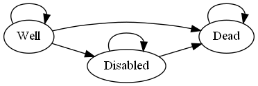

<!-- README.md is generated from README.Rmd. Please edit that file -->

```{r, include = FALSE}
knitr::opts_chunk$set(
  collapse = TRUE,
  comment = "#>",
  fig.path = "man/figures/README-",
  out.width = "75%"
)
```

# rdecision

<!-- badges: start -->
[](https://CRAN.R-project.org/package=rdecision)
[](https://codecov.io/github/ajsims1704/rdecision)
<!-- badges: end -->

The goal of `rdecision` is to provide methods for assessing health care 
interventions using cohort models (decision trees and semi-Markov models) which
can be constructed using only a few lines of R code. Mechanisms
are provided for associating an uncertainty distribution with each source 
variable and for ensuring transparency of the mathematical relationships between
variables. The package terminology follows Briggs *et al* "Decision Modelling
for Health Economic Evaluation" [@briggs2006].

## Installation

You can install the released version of rdecision from 
[CRAN](https://CRAN.R-project.org) with:

``` r
install.packages("rdecision")
```

## Examples

### A decision tree with parameter uncertainty
Consider the fictitious and idealized decision problem of choosing between
providing two 
forms of lifestyle advice, offered to people with vascular disease, which reduce
the risk of needing an interventional procedure. The model has a time horizon of 
1 year. The cost to a healthcare provider of the interventional procedure 
(e.g. inserting a stent) is 5000 GBP; the cost of providing the current form of
lifestyle advice, an appointment with a dietician ("diet"), is 50 GBP and the
cost of providing an alternative form, attendance at an exercise
programme ("exercise"), is 500 GBP. If the advice programme is successful, there
is no need for an interventional procedure. In a small trial of the "diet" 
programme, 12 out of 68 patients (17.6%) avoided having a procedure, and in a
separate small trial of the "exercise" programme 18 out of 58 patients (31.0%) 
avoided the procedure. It is assumed that the baseline characteristics in the 
two trials were comparable, that the model is from the perspective of the 
healthcare provider and that the utility is the same for all patients.

A decision tree can be constructed to estimate the uncertainty of the cost 
difference between the two types of advice programme, due to the finite sample 
sizes of each trial. The proportions of each advice programme being successful
(i.e. avoiding intervention) are represented by model variables with 
uncertainties which follow Beta distributions. Probabilities of the failure
of the programmes are calculated using expression model variables to ensure
that the total probability associated with each chance node is one.

```{r pvars, echo=TRUE}
library("rdecision")
# probabilities of programme success & failure
p.diet <- BetaModVar$new("P(diet)", "", alpha=12, beta=68-12)
p.exercise <- BetaModVar$new("P(exercise)", "", alpha=18, beta=58-18)
q.diet <- ExprModVar$new("1-P(diet)", "", rlang::quo(1-p.diet))
q.exercise <- ExprModVar$new("1-P(exercise)", "", rlang::quo(1-p.exercise))
# costs
c.diet <- 50
c.exercise <- ConstModVar$new("Cost of exercise programme", "GBP", 500)
c.stent <- 5000
```

The decision tree is constructed from nodes and edges as follows:
```{r tree, echo=TRUE}
t.ds <- LeafNode$new("no stent")
t.df <- LeafNode$new("stent")
t.es <- LeafNode$new("no stent")
t.ef <- LeafNode$new("stent")
c.d <- ChanceNode$new("Outcome")
c.e <- ChanceNode$new("Outcome")
d <- DecisionNode$new("Programme")

e.d <- Action$new(d, c.d, cost=c.diet, label = "Diet")
e.e <- Action$new(d, c.e, cost=c.exercise, label = "Exercise")
e.ds <- Reaction$new(c.d, t.ds, p=p.diet, cost = 0, label = "success")
e.df <- Reaction$new(c.d, t.df, p=q.diet, cost=c.stent, label="failure")
e.es <- Reaction$new(c.e, t.es, p=p.exercise, cost=0, label="success")
e.ef <- Reaction$new(c.e, t.ef, p=q.exercise, cost=c.stent, label="failure")

DT <- DecisionTree$new(
  V = list(d, c.d, c.e, t.ds, t.df, t.es, t.ef),
  E = list(e.d, e.e, e.ds, e.df, e.es, e.ef)
)
```

```{r treedraw,echo=FALSE,results="hide",fig.align="center"}
DT$draw(border = TRUE)
```

```{r pointestimate, echo=FALSE}
RES <- DT$evaluate()
c.exercise.t <- DT$threshold(
  index=list(e.e), ref=list(e.d), mvd=c.exercise$description(),
  a=c.exercise$mean(), b=1000, tol=1
)
p.ex.t <- DT$threshold(
  index=list(e.e), ref=list(e.d), mvd=p.exercise$description(),
  a=0, b=p.exercise$mean(), tol=0.001
)
```
The expected per-patient net cost of each option is obtained by evaluating the
tree with expected values of all variables using `DT$evaluate()` and threshold
values with `DT$threshold()`. Examination of the results of evaluation shows
that the expected per-patient net cost of the diet advice programme 
is `r round(RES$Cost[RES$Programme=="Diet"],2)` GBP 
and the per-patient net cost of the exercise programme 
is `r round(RES$Cost[RES$Programme=="Exercise"],2)` GBP, a point estimate saving
of
`r round(RES$Cost[RES$Programme=="Diet"]-RES$Cost[RES$Programme=="Exercise"],2)`
GBP per patient if the exercise advice programme is adopted. By univariate 
threshold analysis, the exercise program will be cost saving when its cost of
delivery is less than `r round(c.exercise.t,2)` GBP
or when its success rate is greater than `r round(100*p.ex.t,1)`%.

```{r psa, echo=FALSE}
N <- 1000
RES <- DT$evaluate(setvars="random", by="run", N=N)
RES$Difference <- RES$Cost.Diet - RES$Cost.Exercise
```

The confidence interval of the
cost saving is estimated by repeated evaluation of the tree, each time sampling
from the uncertainty distribution of the two probabilities using, for example, 
`DT$evaluate(setvars="random", N=1000)` and inspecting the resulting data frame.
From `r N` runs, the 95% confidence interval of the per patient cost saving 
is `r round(quantile(RES$Difference, probs=c(0.025)),2)` GBP 
to `r round(quantile(RES$Difference, probs=c(0.975)),2)` GBP, with
`r round(100*(sum(RES$Difference>0)/N),1)`% being cost saving, and it can be
concluded that more evidence is required to be confident that the exercise
programme is cost saving.

## A three-state Markov model
Sonnenberg and Beck [-@sonnenberg1993] introduced an illustrative example of a
semi-Markov process with three states: "Well", "Disabled" and "Dead" and one
transition between each state, each with a per-cycle probability. In
`rdecision` such a model is constructed as follows. Note that transitions
from a state to itself must be specified if allowed, otherwise the state would
be a temporary state.

```{r markoveg-model, echo=TRUE}
# create states
s.well <- MarkovState$new(name="Well", utility=1)
s.disabled <- MarkovState$new(name="Disabled",utility=0.7)
s.dead <- MarkovState$new(name="Dead",utility=0)
# create transitions, leaving rates undefined
E <- list(
  Transition$new(s.well, s.well),
  Transition$new(s.dead, s.dead),
  Transition$new(s.disabled, s.disabled),
  Transition$new(s.well, s.disabled),
  Transition$new(s.well, s.dead),
  Transition$new(s.disabled, s.dead)
)
# create the model
M <- SemiMarkovModel$new(V = list(s.well, s.disabled, s.dead), E)
# create transition probability matrix
snames <- c("Well","Disabled","Dead")
Pt <- matrix(
  data = c(0.6, 0.2, 0.2, 0, 0.6, 0.4, 0, 0, 1),
  nrow = 3, byrow = TRUE,
  dimnames = list(source=snames, target=snames)
)
# set the transition rates from per-cycle probabilities
M$set_probabilities(Pt)
```

```{r sb,echo=FALSE,fig.align="center"}
#DOT <- M$as_DOT()
#writeLines(DOT, con="man/figures/README-sb-1.gv")
#system2(
#  command="dot", 
#  args=c("-Tpng","-o",
#         "man/figures/README-sb-1.png",
#         "man/figures/README-sb-1.gv"
#         )
#)
#
```


With a starting population of 10,000, the model can be run for 25 years as
follows. The output of the `cycles` function is the Markov trace, shown
below, which replicates Table 2 [@sonnenberg1993].
```{r markoveg-cycle, echo=TRUE}
# set the starting populations
M$reset(c(Well=10000, Disabled=0, Dead=0)) 
# cycle
MT <- M$cycles(25, hcc.pop=FALSE, hcc.cost=FALSE)
```

```{r markoveg-trace, echo=FALSE}
MT$CU <- cumsum(MT$QALY)
keep <- c("Years", "Well", "Disabled", "Dead", "CU")
rows <- c(1,2,3,4,24,25,26)
pander::pander(
  MT[rows,keep], row.names=FALSE, justify="rrrrr", round=c(2,0,0,0,3),
  col.names=c("Years", "Well", "Disabled", "Dead", "Cumulative Utility")
)
```

# Acknowledgements
In addition to using base R [@rcoreteam2020], `redecision` relies heavily on
the `R6` implementation of classes [@chang2020] and the `rlang` package for
error handling and non-standard evaluation used in expression model variables
[@henry2020]. Building the package vignettes and documentation relies on the
`testthat` package [@wickham2011], the `devtools` package [@wickham2020] and
`rmarkdown` [@xie2018a,@allaire2020,@xie2020].

Underpinning graph theory is based on terminology, definitions and
algorithms from Gross *et al* [-@gross2013], the Wikipedia 
glossary [@wikipedia2021] and links therein. Topological sorting of graphs
is based on Kahn's algorithm [-@kahn1962]. Some of the terminology for decision
trees was based on the work of Kaminski *et al* [-@kaminski2018] and an 
efficient tree drawing algorithm was based on the work of Walker [-@walker1989].
In semi-Markov models, representations are exported in the
DOT language [@gansner1993].

Terminology for decision trees and Markov models in health economic evaluation
was based on the book by Briggs *et al* [-@briggs2006] and the output format
and terminology follows ISPOR recommendations [@briggs2012a,@siebert2012]. 

Citations for examples used in vignettes are given in applicable vignette
files. 

# References

