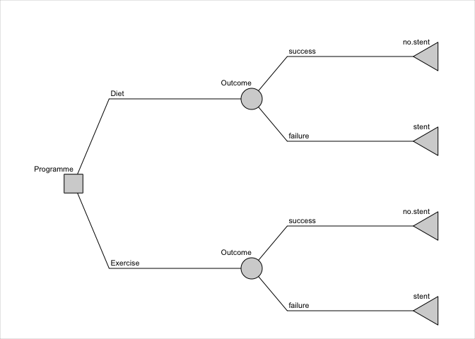

<!-- README.md is generated from README.Rmd. Please edit that file -->

# rdecision

<!-- badges: start -->

[](https://CRAN.R-project.org/package=rdecision)
[](https://codecov.io/gh/ajsims1704/rdecision?branch=master)
<!-- badges: end -->

The goal of `rdecision` is to provide methods for assessing health care
interventions using cohort models (decision trees). Mechanisms are
provided for associating an uncertainty distribution with each source
variable and for ensuring transparency of the mathematical relationships
between variables. The package terminology follows Briggs *et al*
“Decision Modelling for Health Economic Evaluation”.<sup>1</sup>

## Installation

You can install the released version of rdecision from
[CRAN](https://CRAN.R-project.org) with:

``` r
install.packages("rdecision")
```

## Example

Consider the fictitious and idealized decision problem of choosing
between providing two forms of lifestyle advice, offered to people with
vascular disease, which reduce the risk of needing an interventional
procedure. The model has a time horizon of 1 year. The cost to a
healthcare provider of the interventional procedure (e.g. inserting a
stent) is 3000 GBP; the cost of providing the current form of lifestyle
advice, an appointment with a dietician (“diet”), is 50 GBP and the cost
of providing an alternative form, attendance at an exercise programme
(“exercise”), is 500 GBP. If the advice programme is successful, there
is no need for an interventional procedure. In a small trial of the
“diet” programme, 12 out of 68 patients avoided having a procedure, and
in a separate small trial of the “exercise” programme 18 out of 58
patients avoided the procedure. It is assumed that the baseline
characteristics in the two trials were comparable, that the model is
from the perspective of the healthcare provider and that the utility is
the same for all patients.

A decision tree can be constructed to estimate the uncertainty of the
cost difference between the two types of advice programme, due to the
finite sample sizes of each trial. The proportions of each advice
programme being successful (i.e. avoiding intervention) are represented
by model variables with uncertainties which follow Beta distributions.
Probabilities of the failure of the programmes are calculated using
expression model variables to ensure that the total probability
associated with each chance node is one.

``` r
library("rdecision")
p.diet <- BetaModVar$new("P(diet)", "", alpha=12, beta=68-12)
p.exercise <- BetaModVar$new("P(exercise)", "", alpha=18, beta=58-18)
q.diet <- ExprModVar$new("1-P(diet)", "", rlang::quo(1-p.diet))
q.exercise <- ExprModVar$new("1-P(exercise)", "", rlang::quo(1-p.exercise))
```

The decision tree is constructed from nodes and edges as follows:

``` r
t.ds <- LeafNode$new("no stent")
t.df <- LeafNode$new("stent")
t.es <- LeafNode$new("no stent")
t.ef <- LeafNode$new("stent")
c.d <- ChanceNode$new("Outcome")
c.e <- ChanceNode$new("Outcome")
d <- DecisionNode$new("Programme")

e.d <- Action$new(d, c.d, cost = 50, label = "Diet")
e.e <- Action$new(d, c.e, cost = 500, label = "Exercise")
e.ds <- Reaction$new(c.d, t.ds, p = p.diet, cost = 0, label = "success")
e.df <- Reaction$new(c.d, t.df, p = q.diet, cost = 5000, label = "failure")
e.es <- Reaction$new(c.e, t.es, p = p.exercise, cost = 0, label = "success")
e.ef <- Reaction$new(c.e, t.ef, p = q.exercise, cost = 5000, label = "failure")

DT <- DecisionTree$new(
  V = list(d, c.d, c.e, t.ds, t.df, t.es, t.ef),
  E = list(e.d, e.e, e.ds, e.df, e.es, e.ef)
)
```



The expected per-patient cost of each option is obtained by evaluating
the tree with expected values of all variables using `DT$evaluate()`.
Examination of the data frame from this call shows that the expected
per-patient cost of the diet advice programme is 4167.65 GBP and the
per-patient cost of the exercise programme is 3948.28 GBP, a point
estimate saving of 219.37 per patient if the exercise advice programme
is adopted.

The confidence interval of the cost saving is estimated by repeated
evaluation of the tree, each time sampling from the uncertainty
distribution of the two probabilities using, for example,
`DT$evaluate(setvars="random", N=1000)` and inspecting the resulting
data frame. From 1000 runs, the 95% confidence interval of the per
patient cost saving is -516.67 GBP to 1017.04 GBP and it can be
concluded that there is no evidence for there being a cost difference
between the choices.

# Acknowledgements

In addition to using base R,<sup>2</sup> `redecision` relies heavily on
the `R6` implementation of classes<sup>3</sup> and the `rlang` package
for error handling and non-standard evaluation used in expression model
variables.<sup>4</sup> Building the package vignettes and documentation
rely on the `testthat` package,<sup>5</sup> the `devtools`
package<sup>6</sup> and `rmarkdown`.<sup>9</sup>

Underpinning graph theory is based on terminology, definitions and
algorithms from Gross *et al*,<sup>10</sup> the Wikipedia
glossary<sup>11</sup> and links therein. Topological sorting of graphs
is based on Kahn’s algorithm.<sup>12</sup> Some of the terminology for
decision trees was based on the work of Kamiński *et al*<sup>13</sup>
and an efficient tree drawing algorithm was based on the work of
Walker.<sup>14</sup> Terminology for decision trees in health economic
evaluation was based on the book by Briggs *et al*<sup>1</sup> and the
output format and terminology follows ISPOR
recommendations.<sup>15</sup>

Citations for examples used in vignettes are given in applicable
vignette files.

# References

<div id="refs" class="references csl-bib-body">

<div id="ref-briggs2006" class="csl-entry">

<span class="csl-left-margin">1 </span><span
class="csl-right-inline">Briggs A, Claxton K, Sculpher M. *Decision
modelling for health economic evaluation*. Oxford, UK: Oxford University
Press; 2006.</span>

</div>

<div id="ref-rcoreteam2020" class="csl-entry">

<span class="csl-left-margin">2 </span><span class="csl-right-inline">R
Core Team. *R: A language and environment for statistical computing*.
Vienna, Austria: R Foundation for Statistical Computing; 2020.</span>

</div>

<div id="ref-chang2020" class="csl-entry">

<span class="csl-left-margin">3 </span><span
class="csl-right-inline">Chang W. *R6: Encapsulated classes with
reference semantics*. 2020.</span>

</div>

<div id="ref-henry2020" class="csl-entry">

<span class="csl-left-margin">4 </span><span
class="csl-right-inline">Henry L, Wickham H. *Rlang: Functions for base
types and core r and ’tidyverse’ features*. 2020.</span>

</div>

<div id="ref-wickham2011" class="csl-entry">

<span class="csl-left-margin">5 </span><span
class="csl-right-inline">Wickham H. Testthat: Get started with testing.
*The R Journal* 2011;**3**:5–10.</span>

</div>

<div id="ref-wickham2020" class="csl-entry">

<span class="csl-left-margin">6 </span><span
class="csl-right-inline">Wickham H, Hester J, Chang W. *Devtools: Tools
to make developing r packages easier*. 2020.</span>

</div>

<div id="ref-xie2018a" class="csl-entry">

<span class="csl-left-margin">7 </span><span
class="csl-right-inline">Xie Y, Allaire JJ, Grolemund G. *R markdown:
The definitive guide*. Boca Raton, Florida: Chapman and Hall/CRC;
2018.</span>

</div>

<div id="ref-allaire2020" class="csl-entry">

<span class="csl-left-margin">8 </span><span
class="csl-right-inline">Allaire J, Xie Y, McPherson J, Luraschi J,
Ushey K, Atkins A, *et al.* *Rmarkdown: Dynamic documents for r*.
2020.</span>

</div>

<div id="ref-xie2020" class="csl-entry">

<span class="csl-left-margin">9 </span><span
class="csl-right-inline">Xie Y, Dervieux C, Riederer E. *R markdown
cookbook*. Boca Raton, Florida: Chapman and Hall/CRC; 2020.</span>

</div>

<div id="ref-gross2013" class="csl-entry">

<span class="csl-left-margin">10 </span><span
class="csl-right-inline">Gross JL, Yellen J, Zhang P. *Handbook of Graph
Theory*. 2nd ed. Chapman and Hall/CRC.; 2013.</span>

</div>

<div id="ref-wikipedia2021" class="csl-entry">

<span class="csl-left-margin">11 </span><span
class="csl-right-inline">Wikipedia. Glossary of graph theory.
*Wikipedia* 2021.</span>

</div>

<div id="ref-kahn1962" class="csl-entry">

<span class="csl-left-margin">12 </span><span
class="csl-right-inline">Kahn AB. Topological sorting of large networks.
*Communications of the ACM* 1962;**5**:558–62.
<https://doi.org/10.1145/368996.369025>.</span>

</div>

<div id="ref-kaminski2018" class="csl-entry">

<span class="csl-left-margin">13 </span><span
class="csl-right-inline">Kamiński B, Jakubczyk M, Szufel P. A framework
for sensitivity analysis of decision trees. *Central European Journal of
Operational Research* 2018;**26**:135–59.
<https://doi.org/10.1007/s10100-017-0479-6>.</span>

</div>

<div id="ref-walker1989" class="csl-entry">

<span class="csl-left-margin">14 </span><span
class="csl-right-inline">Walker JQ. *A node-positioning algorithm for
general trees*. Chapel Hill: University of North Carolina; 1989.</span>

</div>

<div id="ref-briggs2012a" class="csl-entry">

<span class="csl-left-margin">15 </span><span
class="csl-right-inline">Briggs AH, Weinstein MC, Fenwick EAL, Karnon J,
Sculpher MJ, Paltiel AD. Model Parameter Estimation and Uncertainty: A
Report of the ISPOR-SMDM Modeling Good Research Practices Task Force-6.
*Value in Health* 2012;**15**:835–42.
<https://doi.org/10.1016/j.jval.2012.04.014>.</span>

</div>

</div>
