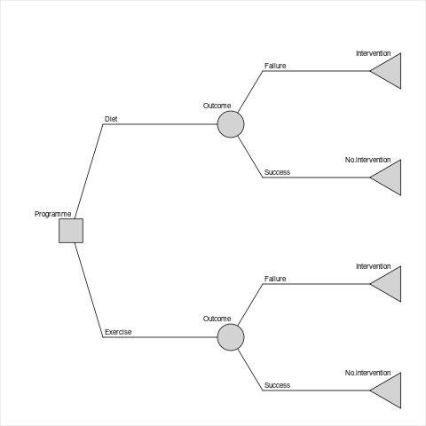
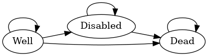

<!-- README.md is generated from README.Rmd. Please edit that file -->

# rdecision

<!-- badges: start -->

[](https://CRAN.R-project.org/package=rdecision)

[](https://codecov.io/github/ajsims1704/rdecision)
<!-- badges: end -->

The goal of `rdecision` is to provide methods for assessing health care
interventions using cohort models (decision trees and semi-Markov
models) which can be constructed using only a few lines of R code.
Mechanisms are provided for associating an uncertainty distribution with
each source variable and for ensuring transparency of the mathematical
relationships between variables. The package terminology follows Briggs
*et al* “Decision Modelling for Health Economic Evaluation”<sup>1</sup>.

## Installation

You can install the released version of rdecision from
[CRAN](https://CRAN.R-project.org) with:

``` r
install.packages("rdecision")
```

## Examples

### A decision tree with parameter uncertainty

Consider the fictitious and idealized decision problem of choosing
between providing two forms of lifestyle advice, offered to people with
vascular disease, which reduce the risk of needing an interventional
procedure. It is assumed that the interventional procedure is the
insertion of a stent, that the current standard of care is the provision
of dietary advice, and that the new form of care is enrolment on an
exercise programme. To assess the decision problem, we construct a model
from the perspective of a healthcare provider, with a time horizon of
one year, and assume that the utility of both forms of advice is equal.
The model evaluates the incremental benefit of the exercise programme as
the incremental number of interventional procedures avoided against the
incremental cost of the exercise programme.

The cost to a healthcare provider of the interventional procedure (e.g.,
inserting a stent) is 5000 GBP; the cost of providing the current form
of lifestyle advice, an appointment with a dietician (“diet”), is 50 GBP
and the cost of providing an alternative form, attendance at an exercise
programme (“exercise”), is 750 GBP. None of the costs are subject to
uncertainty, and are modelled as constant model variables.

``` r
cost_diet <- ConstModVar$new("Cost of diet programme", "GBP", 50.0)
cost_exercise <- ConstModVar$new("Cost of exercise programme", "GBP", 750.0)
cost_stent <- ConstModVar$new("Cost of stent intervention", "GBP", 5000.0)
```

If an advice programme is successful, there is no need for an
interventional procedure. In a small trial of the “diet” programme, 12
out of 68 patients (17.6%) avoided having a procedure, and in a separate
small trial of the “exercise” programme 18 out of 58 patients (31.0%)
avoided the procedure. It is assumed that the baseline characteristics
in the two trials were comparable. The trial results are represented as
scalar integers.

``` r
s_diet <- 12L
f_diet <- 56L
s_exercise <- 18L
f_exercise <- 40L
```

The proportions of the two programmes being successful (i.e., avoiding
an interventional procedure) are uncertain due to the finite size of
each trial and are represented by model variables with uncertainties
which follow Beta distributions. Probabilities of the failure of the
programmes are calculated using expression model variables to ensure
that the total probability associated with each chance node is one.

``` r
p_diet <- BetaModVar$new(
  alpha = s_diet, beta = f_diet, description = "P(diet)", units = ""
)
p_exercise <- BetaModVar$new(
  alpha = s_exercise, beta = f_exercise, description = "P(exercise)", units = ""
)

q_diet <- ExprModVar$new(
  rlang::quo(1.0 - p_diet), description = "1 - P(diet)", units = ""
)
q_exercise <- ExprModVar$new(
  rlang::quo(1.0 - p_exercise), description = "1 - P(exercise)", units = ""
)
```

The decision tree has one decision node, representing the single choice
of the decision problem (i.e., between the two advice programmes), two
chance nodes, representing whether each programme is a success or
failure, and four leaf nodes (intervention or no intervention for each
of the two programmes).

``` r
decision_node <- DecisionNode$new("Programme")
```

``` r
chance_node_diet <- ChanceNode$new("Outcome")
chance_node_exercise <- ChanceNode$new("Outcome")
```

``` r
leaf_node_diet_no_stent <- LeafNode$new("No intervention")
leaf_node_diet_stent <- LeafNode$new("Intervention")
leaf_node_exercise_no_stent <- LeafNode$new("No intervention")
leaf_node_exercise_stent <- LeafNode$new("Intervention")
```

There are two action edges emanating from the decision node, which
represent the two choices, and four reaction edges, representing the
consequences of the success and failure of each programme.

``` r
action_diet <- Action$new(
  decision_node, chance_node_diet, cost = cost_diet, label = "Diet"
)
action_exercise <- Action$new(
  decision_node, chance_node_exercise, cost = cost_exercise, label = "Exercise"
)
```

``` r
reaction_diet_success <- Reaction$new(
  chance_node_diet, leaf_node_diet_no_stent,
  p = p_diet, cost = 0.0, label = "Success"
)

reaction_diet_failure <- Reaction$new(
  chance_node_diet, leaf_node_diet_stent,
  p = q_diet, cost = cost_stent, label = "Failure"
)

reaction_exercise_success <- Reaction$new(
  chance_node_exercise, leaf_node_exercise_no_stent,
  p = p_exercise, cost = 0.0, label = "Success"
)

reaction_exercise_failure <- Reaction$new(
  chance_node_exercise, leaf_node_exercise_stent,
  p = q_exercise, cost = cost_stent, label = "Failure"
)
```

The decision tree model is constructed from the nodes and edges.

``` r
dt <- DecisionTree$new(
  V = list(
    decision_node,
    chance_node_diet,
    chance_node_exercise,
    leaf_node_diet_no_stent,
    leaf_node_diet_stent,
    leaf_node_exercise_no_stent,
    leaf_node_exercise_stent
  ),
  E = list(
    action_diet,
    action_exercise,
    reaction_diet_success,
    reaction_diet_failure,
    reaction_exercise_success,
    reaction_exercise_failure
  )
)
```



The method `evaluate` is used to calculate the costs and utilities
associated with the decision problem. By default, it evaluates it once
with all the model variables set to their expected values and returns a
data frame.

``` r
rs <- dt$evaluate()
```

Examination of the results of evaluation shows that the expected
per-patient net cost of the diet advice programme is 4,168 GBP and the
per-patient net cost of the exercise programme is 4,198 GBP; i.e., the
net cost of the exercise programme exceeds the diet programme by 31 GBP
per patient. The savings associated with the greater efficacy of the
exercise programme do not offset the increased cost of delivering it.

To estimate the uncertainty of the relative effectiveness, the
probabilities of the success proportions of the two treatments can be
represented as model variables who uncertainty follows a Beta
distribution, and the decision tree re-evaluated.

``` r
action_diet$set_cost(cost_diet)
action_exercise$set_cost(cost_exercise)
```

``` r
reaction_diet_success$set_probability(p_diet)

reaction_diet_failure$set_probability(q_diet)
reaction_diet_failure$set_cost(cost_stent)

reaction_exercise_success$set_probability(p_exercise)

reaction_exercise_failure$set_probability(q_exercise)
reaction_exercise_failure$set_cost(cost_stent)
```

``` r
N <- 1000L
rs <- dt$evaluate(setvars = "random", by = "run", N = N)
```

The confidence interval of the cost saving is estimated by repeated
evaluation of the tree, each time sampling from the uncertainty
distribution of the two probabilities using, for example,
`DT$evaluate(setvars = "random", N = 1000L)` and inspecting the
resulting data frame. From 1000 runs, the 95% confidence interval of the
per patient cost saving is -814.53 GBP to 707.3 GBP, with 47.5% being
cost saving. Although the exercise programme is more costly to provide
than the dietary advice programme, it is more effective and leads to
saving overall because fewer costly interventional procedures are
needed. However, due to the uncertainties of the effectiveness of each
programme, it can be concluded that more evidence is required to be
confident that the exercise programme is cost saving overall.

The method `threshold` is used to find the threshold of one of the model
variables at which the cost difference reaches zero. By univariate
threshold analysis, the exercise program will be cost saving when its
cost of delivery is less than 719 GBP or when its success rate is
greater than 31.74%. These thresholds are also subject to uncertainty.

### A three-state Markov model

Sonnenberg and Beck<sup>2</sup> introduced an illustrative example of a
semi-Markov process with three states: “Well”, “Disabled” and “Dead” and
one transition between each state, each with a per-cycle probability. In
`rdecision` such a model is constructed as follows. Note that
transitions from a state to itself must be specified if allowed,
otherwise the state would be a temporary state.

``` r
# create states
s.well <- MarkovState$new(name = "Well", utility = 1.0)
s.disabled <- MarkovState$new(name = "Disabled", utility = 0.7)
s.dead <- MarkovState$new(name = "Dead", utility = 0.0)
```

``` r
# create transitions leaving rates undefined
E <- list(
  Transition$new(s.well, s.well),
  Transition$new(s.dead, s.dead),
  Transition$new(s.disabled, s.disabled),
  Transition$new(s.well, s.disabled),
  Transition$new(s.well, s.dead),
  Transition$new(s.disabled, s.dead)
)
```

``` r
# create the model
M <- SemiMarkovModel$new(V = list(s.well, s.disabled, s.dead), E)
```

``` r
# create transition probability matrix
snames <- c("Well", "Disabled", "Dead")
Pt <- matrix(
  data = c(0.6, 0.2, 0.2, 0.0, 0.6, 0.4, 0.0, 0.0, 1.0),
  nrow = 3L, byrow = TRUE,
  dimnames = list(source = snames, target = snames)
)
# set the transition rates from per-cycle probabilities
M$set_probabilities(Pt)
```



With a starting population of 10,000, the model can be run for 25 years
as follows.

``` r
# set the starting populations
M$reset(c(Well = 10000.0, Disabled = 0.0, Dead = 0.0))
```

``` r
# cycle
MT <- M$cycles(25L, hcc.pop = FALSE, hcc.cost = FALSE)
```

The output, after rounding, of the `cycles` function is the Markov
trace, shown below, which replicates Table 2<sup>2</sup>. In more recent
usage, cumulative utility is normally called incremental utility, and
expressed per patient (i.e., divided by 10,000).

| Years |  Well | Disabled |  Dead | Cumulative Utility |
|------:|------:|---------:|------:|-------------------:|
|     0 | 10000 |        0 |     0 |                  0 |
|     1 |  6000 |     2000 |  2000 |               7400 |
|     2 |  3600 |     2400 |  4000 |              12680 |
|     3 |  2160 |     2160 |  5680 |              16352 |
|    23 |     0 |        1 |  9999 |              23749 |
|    24 |     0 |        0 | 10000 |              23749 |
|    25 |     0 |        0 | 10000 |              23750 |

# Acknowledgements

In addition to using base R<sup>3</sup>, `redecision` relies heavily on
the `R6` implementation of classes<sup>4</sup> and the `rlang` package
for error handling and non-standard evaluation used in expression model
variables<sup>5</sup>. Building the package vignettes and documentation
relies on the `testthat` package<sup>6</sup>, the `devtools`
package<sup>7</sup> and `rmarkdown`<sup>10</sup>.

Underpinning graph theory is based on terminology, definitions and
algorithms from Gross *et al*<sup>11</sup>, the Wikipedia
glossary<sup>12</sup> and links therein. Topological sorting of graphs
is based on Kahn’s algorithm<sup>13</sup>. Some of the terminology for
decision trees was based on the work of Kaminski *et al*<sup>14</sup>
and an efficient tree drawing algorithm was based on the work of
Walker<sup>15</sup>. In semi-Markov models, representations are exported
in the DOT language<sup>16</sup>.

Terminology for decision trees and Markov models in health economic
evaluation was based on the book by Briggs *et al*<sup>1</sup> and the
output format and terminology follows ISPOR
recommendations<sup>18</sup>.

Citations for examples used in vignettes are given in applicable
vignette files.

# References

<div id="refs" class="references csl-bib-body" line-spacing="2">

<div id="ref-briggs2006" class="csl-entry">

<span class="csl-left-margin">1. </span><span
class="csl-right-inline">Briggs, A., Claxton, K. & Sculpher, M.
*Decision modelling for health economic evaluation*. (Oxford University
Press, 2006).</span>

</div>

<div id="ref-sonnenberg1993" class="csl-entry">

<span class="csl-left-margin">2. </span><span
class="csl-right-inline">Sonnenberg, F. A. & Beck, J. R. [Markov models
in medical decision making: A practical
guide](https://doi.org/10.1177/0272989X9301300409). *Medical Decision
Making* **13,** 322–338 (1993).</span>

</div>

<div id="ref-rcoreteam" class="csl-entry">

<span class="csl-left-margin">3. </span><span class="csl-right-inline">R
Core Team. *R: A language and environment for statistical computing*.
(2021). at \<<https://www.R-project.org/>\></span>

</div>

<div id="ref-chang2020" class="csl-entry">

<span class="csl-left-margin">4. </span><span
class="csl-right-inline">Chang, W. *R6: Encapsulated classes with
reference semantics*. (2020). at
\<<https://CRAN.R-project.org/package=R6>\></span>

</div>

<div id="ref-henry2020" class="csl-entry">

<span class="csl-left-margin">5. </span><span
class="csl-right-inline">Henry, L. & Wickham, H. *Rlang: Functions for
base types and core r and tidyverse features*. (2020). at
\<<https://CRAN.R-project.org/package=rlang>\></span>

</div>

<div id="ref-wickham2011" class="csl-entry">

<span class="csl-left-margin">6. </span><span
class="csl-right-inline">Wickham, H. [Testthat: Get started with
testing](https://journal.r-project.org/archive/2011-1/RJournal_2011-1_Wickham.pdf).
*The R Journal* **3,** 5–10 (2011).</span>

</div>

<div id="ref-wickham2020" class="csl-entry">

<span class="csl-left-margin">7. </span><span
class="csl-right-inline">Wickham, H., Hester, J. & Chang, W. *Devtools:
Tools to make developing r packages easier*. (2020). at
\<<https://CRAN.R-project.org/package=devtools>\></span>

</div>

<div id="ref-xie2018a" class="csl-entry">

<span class="csl-left-margin">8. </span><span
class="csl-right-inline">Xie, Y., Allaire, J. J. & Grolemund, G. *R
markdown: The definitive guide*. (Chapman; Hall/CRC, 2018). at
\<<https://bookdown.org/yihui/rmarkdown>\></span>

</div>

<div id="ref-allaire2020" class="csl-entry">

<span class="csl-left-margin">9. </span><span
class="csl-right-inline">Allaire, J., Xie, Y., McPherson, J., Luraschi,
J., Ushey, K., Atkins, A., Wickham, H., Cheng, J., Chang, W. & Iannone,
R. *Rmarkdown: Dynamic documents for r*. (2020). at
\<<https://github.com/rstudio/rmarkdown>\></span>

</div>

<div id="ref-xie2020" class="csl-entry">

<span class="csl-left-margin">10. </span><span
class="csl-right-inline">Xie, Y., Dervieux, C. & Riederer, E. *R
markdown cookbook*. (Chapman; Hall/CRC, 2020). at
\<<https://bookdown.org/yihui/rmarkdown-cookbook>\></span>

</div>

<div id="ref-gross2013" class="csl-entry">

<span class="csl-left-margin">11. </span><span
class="csl-right-inline">Gross, J. L., Yellen, J. & Zhang, P. *Handbook
of graph theory*. (Chapman; Hall/CRC., 2013). at
\<<https://doi.org/10.1201/b16132>\></span>

</div>

<div id="ref-wikipedia2021" class="csl-entry">

<span class="csl-left-margin">12. </span><span
class="csl-right-inline">Wikipedia. Glossary of graph theory.
*Wikipedia* (2021). at
\<<https://en.wikipedia.org/wiki/Glossary_of_graph_theory>\></span>

</div>

<div id="ref-kahn1962" class="csl-entry">

<span class="csl-left-margin">13. </span><span
class="csl-right-inline">Kahn, A. B. [Topological sorting of large
networks](https://doi.org/10.1145/368996.369025). *Communications of the
ACM* **5,** 558–562 (1962).</span>

</div>

<div id="ref-kaminski2018" class="csl-entry">

<span class="csl-left-margin">14. </span><span
class="csl-right-inline">Kamiński, B., Jakubczyk, M. & Szufel, P. [A
framework for sensitivity analysis of decision
trees](https://doi.org/10.1007/s10100-017-0479-6). *Central European
Journal of Operational Research* **26,** 135–159 (2018).</span>

</div>

<div id="ref-walker1989" class="csl-entry">

<span class="csl-left-margin">15. </span><span
class="csl-right-inline">Walker, J. Q. *A node-positioning algorithm for
general trees*. (University of North Carolina, 1989). at
\<<http://www.cs.unc.edu/techreports/89-034.pdf>\></span>

</div>

<div id="ref-gansner1993" class="csl-entry">

<span class="csl-left-margin">16. </span><span
class="csl-right-inline">Gansner, E. R., Koutsofios, E., North, S. C. &
Vo, K.-P. [A technique for drawing directed
graphs](https://doi.org/10.1109/32.221135). *IEEE Transactions on
Software Engineering* **19,** 214–230 (1993).</span>

</div>

<div id="ref-briggs2012a" class="csl-entry">

<span class="csl-left-margin">17. </span><span
class="csl-right-inline">Briggs, A. H., Weinstein, M. C., Fenwick, E. A.
L., Karnon, J., Sculpher, M. J. & Paltiel, A. D. [Model parameter
estimation and uncertainty: A report of the ISPOR-SMDM modeling good
research practices task
force-6](https://doi.org/10.1016/j.jval.2012.04.014). *Value in Health*
**15,** 835–842 (2012).</span>

</div>

<div id="ref-siebert2012" class="csl-entry">

<span class="csl-left-margin">18. </span><span
class="csl-right-inline">Siebert, U., Alagoz, O., Bayoumi, A. M., Jahn,
B., Owens, D. K., Cohen, D. J. & Kuntz, K. M. [State-transition
modeling: A report of the ISPOR-SMDM modeling good research practices
task force-3](https://doi.org/10.1016/j.jval.2012.06.014). *Value in
Health* **15,** 812–820 (2012).</span>

</div>

</div>
